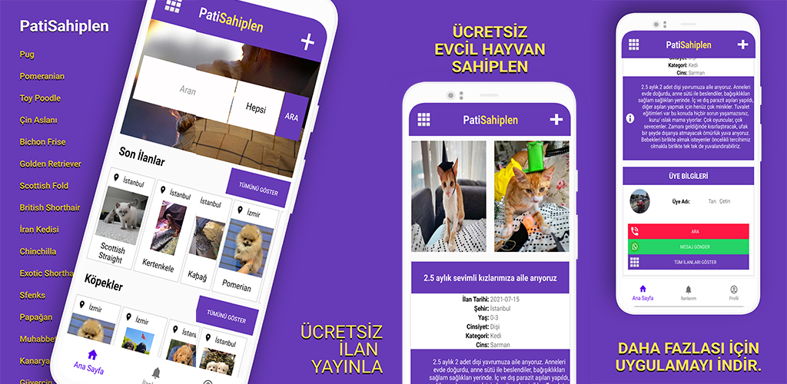

# EvcilHayvanSahiplenApp
Evcil Hayvan Sahiplenme ilanları yayınlanan mobil uygulama.

Uygulama Özellikleri
- Gmail Sign in 
- İlanlar için CRUD işlemleri
- Sözcük ve Şehir ile MYSQL tabloların arama
- Whatsapp Mesaj gönderme ve Direk Arama
- İlanlarda 2 adet görsel ve ilan detayları bulunmaktadır.

Teknik Bilgiler

-Sunucu tarafında node.js / mysql kullandım.

-Retrofit, Picasso kütüphaneleri kullandım.

<b>YOUTUBE VİDEO LİNKİNE AŞAĞIDAN ULAŞABİLİRSİNİZ.</b>

